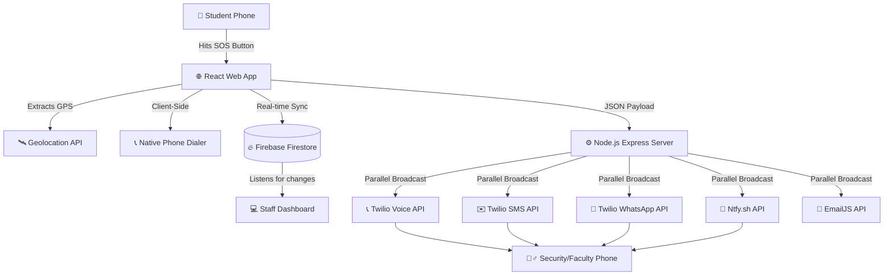

# 🚨 Campus SOS Network


A high-speed, multi-channel emergency alert system designed for university campuses. When a student triggers an SOS, the system captures their exact GPS location and simultaneously broadcasts alerts across **5 different communication channels** to ensure campus security responds immediately.

## ✨ Features

- **One-Tap SOS Trigger:** Rapid response UI for students to select emergency types (Medical, Fire, Security).
- **Auto-Dialer Fallback:** Instantly opens the student's phone dialer to directly call the faculty.
- **5-Channel Server Broadcast:**
  1. 📞 **Cellular Voice Call:** Twilio Programmable Voice calls the faculty and uses text-to-speech to read the alert.
  2. ✉️ **SMS Text Message:** Direct SMS delivery via Twilio.
  3. 💬 **WhatsApp Alert:** Formatted WhatsApp message with a Google Maps link.
  4. 🚨 **Ntfy Siren:** Max-priority push notification that overrides silent mode and blasts a loud siren on the faculty's phone.
  5. 📧 **Email Backup:** Permanent incident record sent to security via EmailJS.
- **Live Staff Dashboard:** Real-time web dashboard that flashes red, plays an HTML5 alarm, and plots the student on a map.

## 🏗 System Architecture



## 🛠 Tech Stack

- **Frontend:** React, Vite, Tailwind CSS, Lucide Icons, Leaflet Maps
- **Backend:** Node.js, Express
- **Database:** Firebase Firestore (Real-time NoSQL)
- **External APIs:** 
  - Twilio (Voice, SMS, WhatsApp)
  - Ntfy.sh (Mobile Push Notifications/Sirens)
  - EmailJS (Automated Emails)

## 🚀 Setup & Installation

**1. Clone the repository**
```bash
git clone https://github.com/yourusername/campus-sos-network.git
cd campus-sos-network
```

**2. Install Dependencies**
```bash
npm install
```

**3. Environment Variables**
Create a `.env` file in the root directory and add your API keys:
```env
VITE_FIREBASE_API_KEY=your_firebase_key
VITE_FIREBASE_PROJECT_ID=your_firebase_project_id
VITE_EMAILJS_SERVICE_ID=your_emailjs_id
VITE_DISPATCH_PHONE_NUMBER=+91XXXXXXXXXX

# Twilio Configuration
TWILIO_ACCOUNT_SID=your_twilio_sid
TWILIO_AUTH_TOKEN=your_twilio_token
TWILIO_VOICE_FROM=+1XXXXXXXXXX
WHATSAPP_PHONE=+91XXXXXXXXXX
```

**4. Build & Run**
```bash
# Build the frontend
npm run build

# Start the unified backend & frontend server
node alert-server.js
```
The application will be live at `http://localhost:4000`.

## 📱 Testing

You can simulate an emergency server broadcast by hitting the test endpoint:
```bash
curl http://localhost:4000/api/test-call
```

## 📄 License
MIT License - Free for educational and campus safety use.
